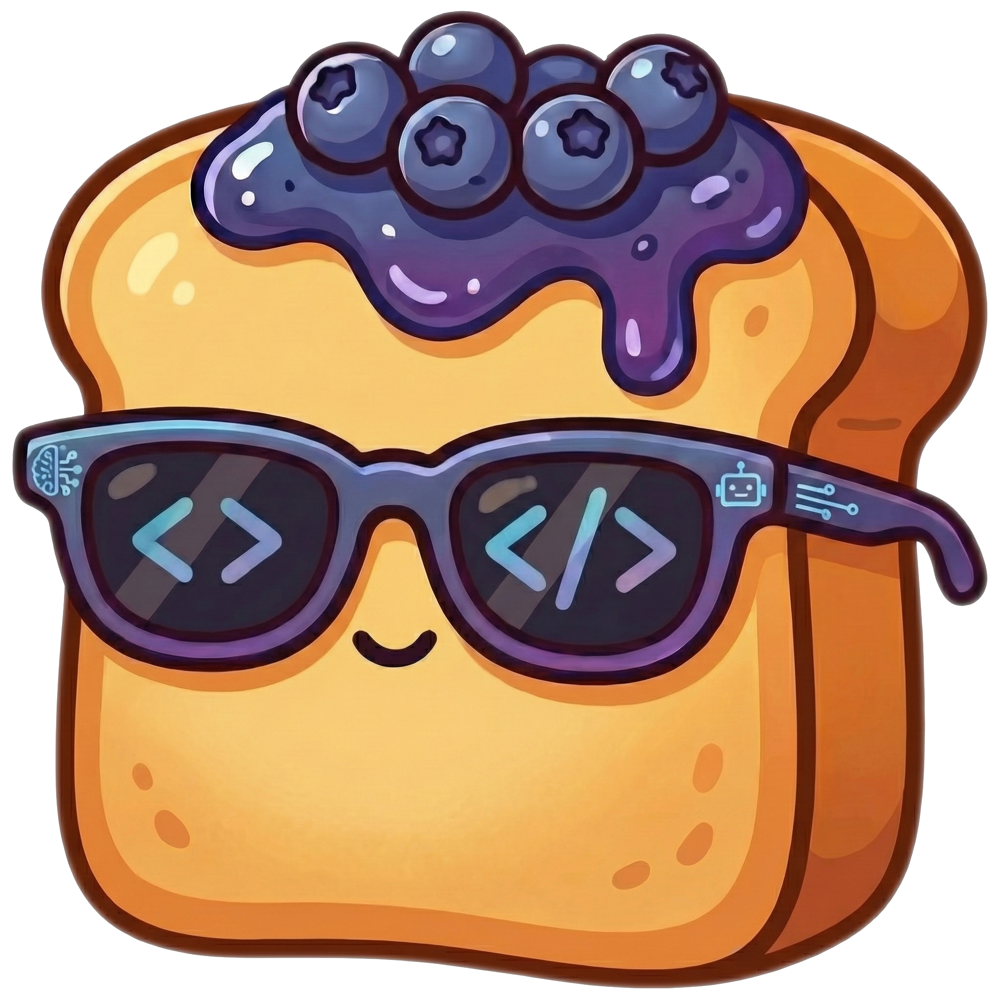

#  Welcome to VibeJam!

[](http://creativecommons.org/publicdomain/zero/1.0/)
[](https://nextjs.org/)
[](https://fastapi.tiangolo.com/)

The first platform for researchers to run user studies on **vibe-coding**—without any local setup required from participants.

Users code with an AI assistant to build websites or complete LeetCode-style functions, and all data is logged for research.

---

## ✨ Key features

> **Browser-based coding.** Participants use a task browser, multi-file editor (HTML/CSS/JS or Python), and live preview—all in the browser, with no IDE or local installation. Everything runs on your deployed website so you can recruit widely without asking people to install anything.


> **AI coding agent.** The in-task chat is powered by [Aider](https://github.com/Aider-AI/aider), an open-source coding agent. Like Cursor or Copilot, users describe what they want and the agent edits code and streams progress back. After each run, a short summary and follow-up suggestions (e.g. “Add keyboard controls”) keep the vibe going and give you rich interaction data.


> **Dataset logging.** We log the human–AI collaboration signals that matter for research: agent traces, which suggestions users accept or reject, and responses to post-submission questions. You get structured data ready for analysis without building your own instrumentation.


> **Two diverse task types.** VibeJam supports both **web-development** tasks (build a game or UI from a prompt) and **function-completion** tasks (e.g. LeetCode-style Python with test cases). You can run studies that mix creativity-focused and correctness-focused coding, or focus on one.


> **User authentication and onboarding.** Users sign up, consent via an IRB form, log in, and can reset their password. Progress is **automatically saved** mid-task so they can leave and come back. We also provide a tutorial video and in-app instructions so participants can get started quickly.

> **Post-submission questions.** After a website submission, you can either define questions manually or use our prompts to **generate questions from the participant’s code** (e.g. comprehension checks, "which features exist in your code?"). That lets you measure understanding and attention without writing task-specific questions by hand.


> **Gamification.** We ship with 55 game-based web development tasks that were crowdsourced and selected for being engaging. Submissions can optionally be viewed and voted on by other users, so you can add a lightweight competitive or social layer to your study.

---

## 🎬 Video demo

Curious what it looks like? Watch the walkthrough below!

[](https://www.youtube.com/watch?v=eJ2dppIxG60)

*(Click the image to open the video on YouTube. The same video is also in the app under **Instructions**.)*

---

## 📑 Table of contents

- [Detailed features](#detailed-features)
- [Setup](#setup)
- [Repository structure](#repository-structure)
- [Customization](#customization)
- [Citation](#citation)
- [License](#license)

---

## 📖 Detailed features

### Platform overview

VibeJam is a full-stack application. The frontend is **Next.js**: participants see a task browser, an in-task editor with live preview, and a submit flow. The backend is **FastAPI**: it runs the AI agent, code execution, auth, and APIs for tasks and submissions. All data is stored in **PostgreSQL** (or SQLite for local development). Tasks are defined in JSON files, loaded into the database, and served through the API. That means you can add or change tasks by editing JSON and re-running the load script—no need to redeploy the frontend.

### Task types in depth

**Website tasks.** Each task has a name, title, description (HTML), label (e.g. open-ended or replication), example links, and starter files (e.g. from `data/blank_site/`). Participants edit HTML, CSS, and JavaScript in the browser and see the preview update live. You can add as many website tasks as you want via a single JSON file, or merge `web_tasks.json` and `function_tasks.json` when you load the database.

**Function tasks.** Each task is a single Python file with a problem description, starter code, and test cases. The UI sends the code to a backend runner (OneCompiler via RapidAPI, or a local execution service) and shows pass/fail results. You can require all tests to pass before submission, or allow submission after a “give up” timeout (configurable via `NEXT_PUBLIC_GIVE_UP_SECONDS`). We currently seed 10 function tasks from LiveCodeBench; the JSON format supports any number.

**Tutorials.** We ship two tutorials: a web tutorial and a function tutorial, each with its own instructions. The web tutorial uses a fixed set of submission questions in the frontend (no code-based generation). You can keep both, remove one, or add your own tutorial tasks.

### Agent and execution

**How the agent works.** When a participant sends a message in the in-task chat, the backend creates a temporary workspace with their current files and runs the request through Aider (an open-source coding agent). Aider streams back edits; the backend parses those edits, applies them in memory, and streams the results to the frontend so the editor updates. For website tasks, after each run we also call an LLM to produce a short summary of what changed and a list of follow-up suggestions (e.g. “Handle empty input”, “Add a restart button”). For function tasks you can turn suggestions off and only show the summary. Which model is used and how many concurrent agent instances run are set via env vars (`AIDER_MODEL`, `SUMMARY_MODEL`, `AIDER_MAX_INSTANCES`, etc.).

**Website preview.** For website tasks, the participant can view their HTML/CSS/JS code in an in-browser iframe (the "My Preview" tab). There are no external servers; the sandbox limits (e.g. no CDN, no new files) are described in the in-app instructions.

**Function execution.** For function completion tasks, the participant can test their Python with a test case panel (the "Test Cases" tab). The UI shows test results (pass/fail and output) so participants can fix their code before submitting.

### Submissions and questions

**What happens when someone submits.** Participants enter a title and description for their project, then submit. For website tasks, the backend can then generate follow-up questions from the submitted code. There are three kinds. *Self-report* questions are fixed Likert items (e.g. “I understand how my code works”, “I could explain my code to someone else”). *Code-based* questions are generated from the code: one type asks “which of these features exist in your UI?” (the LLM infers real vs. plausible-fake features from the HTML/CSS/JS), and another asks “which of these JavaScript functions exist?” (real function names vs. LLM-generated distractors). For some tasks you can also insert an optional attention-check question. All of this lives in `backend/routers/submission_questions.py`. Tutorial submissions use a fixed list of questions defined in the frontend (`interface/app/constants/tutorialSubmissionQuestions.ts`), with no code-based generation.

**Rating others’ work.** If you enable it, participants can view and rate other submissions on dimensions you define (e.g. Task Fulfillment, Style, Enjoyment, Creativity). The scale and dimension names are set in `interface/app/constants/submissionRatingCriteria.ts`.

### Instructions and consent

The **About** page shows study instructions (Markdown from `public/instruction_assets/user_instructions.md`), compensation, contact info, and an optional IRB consent form (iframe + PDF download). Contact name and email come from env (`FROM_CONTACT_EMAIL`, `FROM_CONTACT_NAME`) so you can point participants to your team.

---

## 🛠️ Setup

> **Quick start:** `git clone https://github.com/nbalepur/vibe-jam && cd vibe-jam && ./scripts/setup.sh` — then add your `.env` and run `./scripts/start-all.sh`.

### 1. Clone and install

```bash
git clone https://github.com/nbalepur/vibe-jam
cd vibe-jam
./scripts/setup.sh
```

The script checks for Python 3, Node.js, and npm; creates a conda env `helpful-coding` (or uses venv); installs backend and frontend dependencies; and prompts for a `.env` if missing.


### 2. Environment variables

Copy the example file and fill in at least the required vars:

```bash
cp example.env .env
# Edit .env: OPENAI_API_KEY, SECRET_KEY, DATABASE_URL, etc.
```

Then sync env to the frontend (so the Next.js app gets backend URL and contact info). The starting scripts below will also automatically sync these variables:

```bash
cd interface
npm run sync-env
cd ..
```

| Variable | Purpose |
|----------|---------|
| **Required** | `OPENAI_API_KEY` (agent + submission-question generation), `SECRET_KEY` (JWT), `DATABASE_URL` (and `ASYNC_DATABASE_URL` for Postgres). For SQLite, see comments in `database/config.py`. |
| **URLs** | `BACKEND_URL`, `NEXT_PUBLIC_BACKEND_URL`, `FRONTEND_URL`, `NEXT_PUBLIC_FRONTEND_URL` (defaults: backend 4828, frontend 3000). |
| **Contact** | `FROM_CONTACT_EMAIL`, `FROM_CONTACT_NAME` (About page, password-reset emails). |
| **Optional** | `BREVO_API_KEY`, `RESET_LINK_BASE_URL` (password reset); `RAPIDAPI_KEY` or `USE_LOCAL_EXECUTION` (function tasks); `AIDER_MODEL`, `SUMMARY_MODEL`, `AIDER_MAX_INSTANCES`, `AIDER_IDLE_TIMEOUT`, `NEXT_PUBLIC_GIVE_UP_SECONDS`; etc. See `example.env`. |

### 3. Database and tasks

Create tables and load tasks (from a single JSON that contains all projects you want):

```bash
cd database
./scripts/create.sh
./scripts/load.sh
cd ..
```

`load.sh` defaults to `data/tasks.json`. If you don’t have a combined file, either merge `data/web_tasks.json` and `data/function_tasks.json` into one `tasks` array, or run:

```bash
./scripts/load.sh --reset --tasks-path ../data/web_tasks.json
./scripts/load.sh --tasks-path ../data/function_tasks.json
```

### 4. Run

```bash
./scripts/start-all.sh
```

Or run backend and frontend separately: `./scripts/start-backend.sh` and `./scripts/start-frontend.sh`.

- **Frontend:** http://localhost:3000 (or your `NEXT_PUBLIC_FRONTEND_URL` port)
- **Backend:** http://localhost:4828 (or your `BACKEND_URL` port)
- **Health:** http://localhost:4828/health

---

## 📁 Repository structure

```
├── backend/
│   ├── agent/                 # AI agent: Aider, summary, suggestions
│   │   ├── api.py             # HTTP routes (stream, summary, history, clear)
│   │   ├── generation.py     # Summary + follow-up ideas (OpenAI)
│   │   ├── helpers.py         # stream_events, workspace, history
│   │   ├── instances.py       # Per-session Aider instances, timeouts
│   │   ├── code_preferences.py
│   │   └── replace_code.py    # Parse and apply SEARCH/REPLACE blocks
│   ├── code_execution/        # OneCompiler, local runner, endpoint runner
│   ├── routers/               # auth, tasks, submissions, submission_questions, code, execution, users
│   ├── utils/                 # Auth (JWT, Brevo), task_helpers
│   └── main.py
├── database/
│   ├── config.py              # DB URL, pool, get_db
│   ├── models.py              # Pydantic models
│   ├── sqlalchemy_models.py   # ORM
│   ├── crud.py
│   ├── load_tasks.py          # Load tasks from JSON into Project table
│   └── scripts/               # create.sh, load.sh, reset.sh, download.sh
├── interface/
│   ├── app/
│   │   ├── api/               # Next.js API routes (tasks, task-files, execute-function)
│   │   ├── browse/            # Task browse page
│   │   ├── vibe/              # In-task page (editor, preview, chat, submit)
│   │   ├── components/        # Editor, preview, tasks, submissions, auth, layout, UI
│   │   ├── config/            # env.ts
│   │   ├── constants/         # submissionRatingCriteria, tutorialSubmissionQuestions
│   │   ├── context/           # auth, iframe theme
│   │   ├── hooks/             # useVibeTask, useAssistantChat, useTestCasesPanel, etc.
│   │   └── utils/             # task_logic, testCasesUtils, fileTree, downloadProject
│   └── public/                # instruction_assets, task_images, videos, toast.png
├── data/
│   ├── web_tasks.json
│   ├── function_tasks.json
│   ├── web_tutorial.json
│   ├── function_tutorial.json
│   ├── blank_site/             # Starter HTML/CSS/JS for website tasks
│   └── tutorials/
├── scripts/
│   ├── setup.sh
│   ├── start-all.sh
│   ├── start-backend.sh
│   ├── start-frontend.sh
│   └── sync-env.js
└── example.env
```

---

## ⚙️ Customization

### Tasks

- **Edit task data:** `data/web_tasks.json`, `data/function_tasks.json` (or your merged `data/tasks.json`).
- **Website task shape:** Top-level `{ "tasks": [ ... ] }`. Each task: `name` (unique slug), `title`, `description` (HTML), `label` (e.g. `open-ended`, `replication`), `example`, `files` (list of `{ "name", "content"` (path or raw string), `"contentType": "path"|"raw", "language" }`). Starter paths are typically under `data/blank_site/`.
- **Function task shape:** Same `tasks` array. Each task: `name`, `title`, `description`, `files` (e.g. single `solution.py`), `test_cases` (input/expected_output or judge), optional `entry_point`. Use labels `write_function` or `debug_function` so the UI treats them as function tasks.
- **After editing:** Re-run `database/scripts/load.sh` (use `--reset` to replace all projects, or omit to add/update). Task labels are defined in `interface/app/utils/taskLabels.ts`; add new labels there if you introduce new task types.

### Agent

- **Summary and suggestions:** Prompts and parsing in `backend/agent/generation.py` (`generate_summary_and_suggestions`, `generate_summary_only`). Edit to change tone, length, or suggestion count.
- **When suggestions run:** `backend/agent/helpers.py` (`stream_events`). Function tasks typically use `skipSuggestions: true` so only a summary is shown.
- **Model and limits:** `backend/agent/instances.py` (model name, timeouts, max instances). Env: `AIDER_MODEL`, `SUMMARY_MODEL`, `AIDER_MAX_INSTANCES`, `AIDER_IDLE_TIMEOUT`, `AIDER_MAX_IO_MESSAGES`.
- **API contract:** `backend/agent/api.py` defines routes and request/response shapes; keep these consistent if you swap the coder or add new events.

### Post-submission questions

- **Tutorial:** `interface/app/constants/tutorialSubmissionQuestions.ts` — add/remove/reword; types `mcqa` and `multi_select` supported.
- **Self-report (all tasks):** `backend/routers/submission_questions.py`, function `_generate_submission_questions` — edit the list of Likert items.
- **Code-based (website):** Same file — `generate_ui_questions`, `generate_js_questions`, `generate_ui_features`, `generate_distractor_functions`. Adjust prompts or models to change difficulty or format.
- **Rating dimensions:** `interface/app/constants/submissionRatingCriteria.ts` — scale (min/max/default) and dimension names/descriptions for rating others’ submissions.

---

## 📝 Citation

If you used VibeJam for your own research, we’d love a citation! Use the BibTeX below (fill in your paper details when you have them):

```bibtex
@misc{vibejam2025,
  title        = {VibeJam: A Platform for Studying AI-Assisted (Vibe) Coding},
  author       = {},
  year         = {},
  howpublished = {},
  note         = {}
}
```

---

## 📄 License

See [LICENSE](LICENSE).

---

*Thanks for checking out VibeJam and happy vibe-coding! 🍞*
