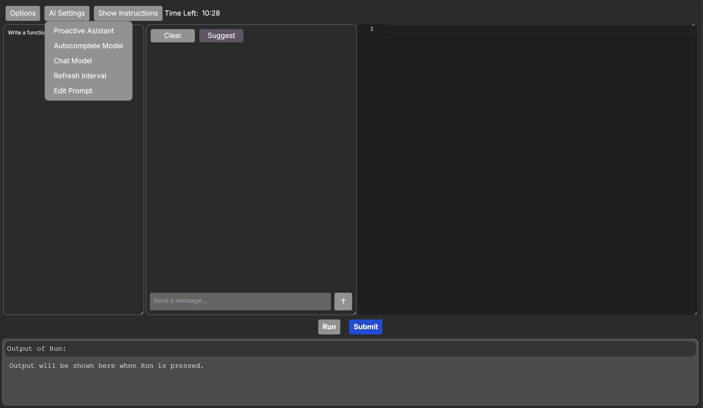
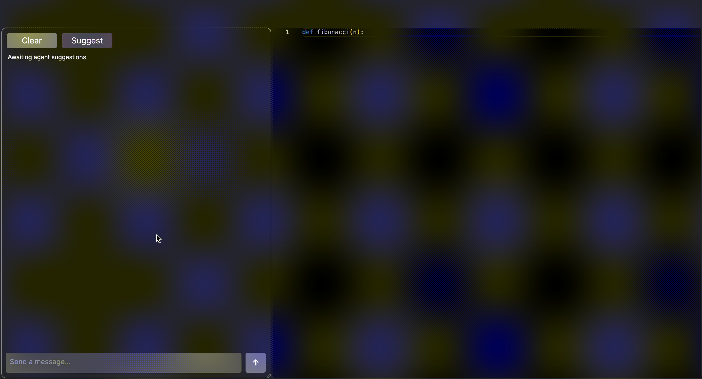

# RealHumanEval Interface

This is a local version of RealHumanEval. Task loading and API calls live in [app/utils/task_logic.ts](app/utils/task_logic.ts); [app/vibe/page.tsx](app/vibe/page.tsx) uses them. To host with non-local APIs (e.g. Firebase), replace or configure those call sites and env as needed.

The repo is organized as follows:

- [app](app): Contains the frontend code for the project.

- [app/components](app/components): Contains the React components for the project.

- [app/utils](app/utils): Contains helper functions (e.g. task loading in `task_logic.ts`).

- The main page is [app/vibe/page.tsx](app/vibe/page.tsx).

### Installation
This is a [Next.js](https://nextjs.org/) project bootstrapped with [`create-next-app`](https://github.com/vercel/next.js/tree/canary/packages/create-next-app).

Follow the instructions below to install the necessary dependencies.


```
npm install next react react-dom
npm install axios
npm install openai
```


You need to your API keys to [app/config/settings.tsx](app/config/settings.tsx) file. For now this is well tested with OpenAI API and OneCompiler API. 


First, run the development server:

```bash
npm run dev
# or
yarn dev
# or
pnpm dev
# or
bun dev
```

Open [http://localhost:4827](http://localhost:4827) with your browser to see the result.

This is what you will see:




